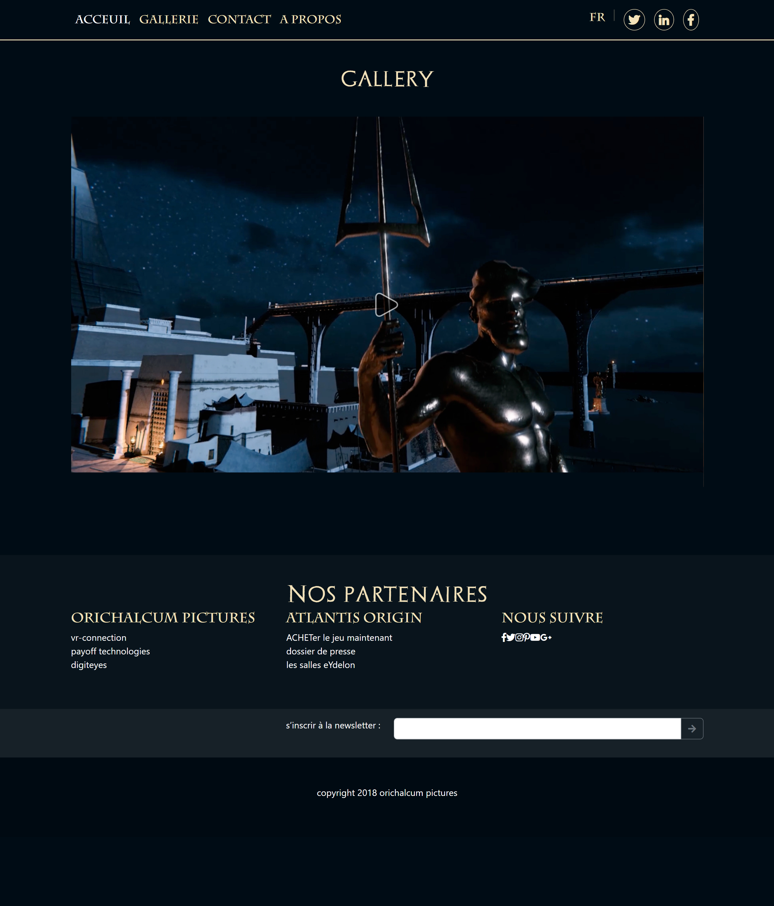
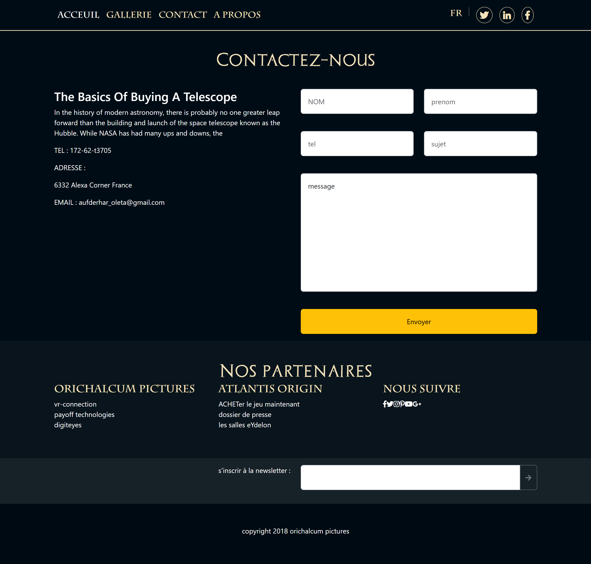
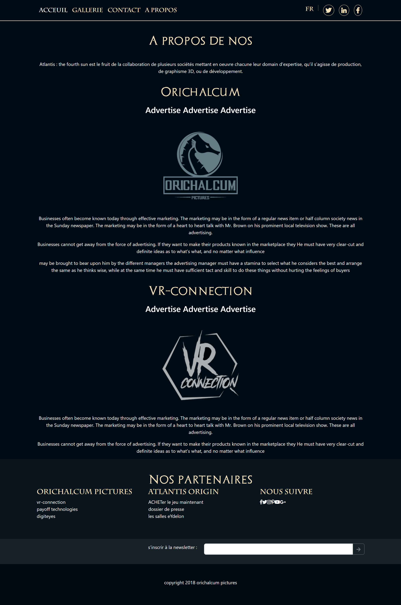

# Atlantis - The Fourth Sun

Projet réalisé durant mon stage d’initiation en 2023.

## Description
Site web statique présentant un univers mystique autour du thème Atlantis.
Projet développé uniquement en front-end.

## Technologies utilisées
- HTML5
- CSS3
- Bootstrap
- Carousel Bootstrap

## Fonctionnalités
- Navigation responsive
- Galerie interactive
- Carousel dynamique
- Design moderne

## Objectif
Améliorer mes compétences en développement front-end et en design responsive.

## Auteur
Malake Znadi
## Screenshots

### Page d'accueil

### Galerie

### Contact

### About
